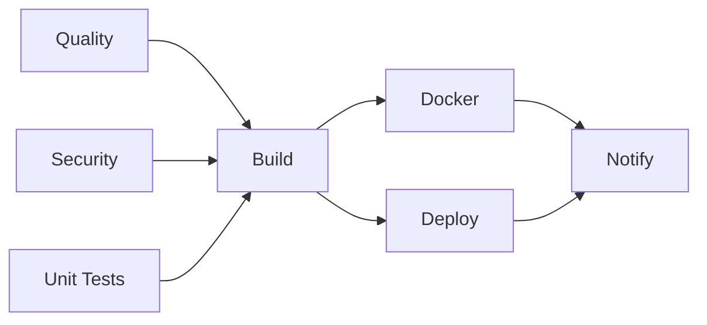
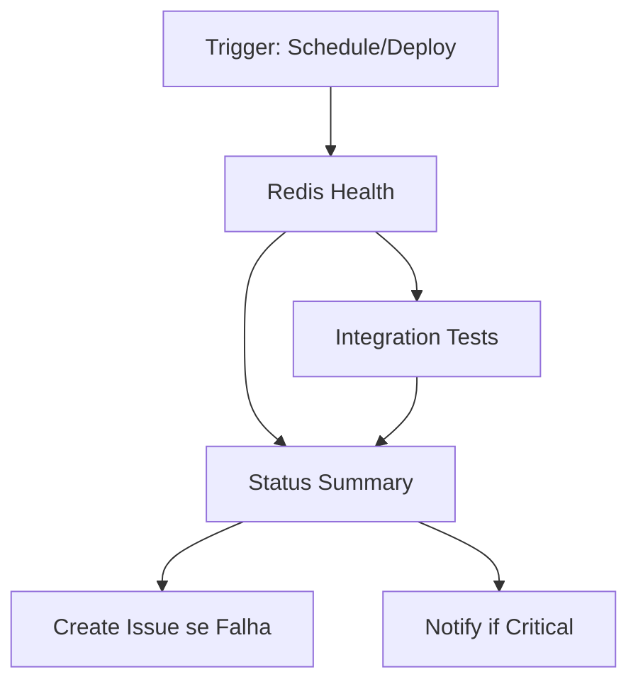

# ♻️ Refatoração da Arquitetura de Pipelines

## 🎯 **Problema Resolvido**

**Antes:** Pipeline CI/CD com dependências externas (Redis) causando falhas intermitentes e timeouts.

**Depois:** Arquitetura separada com responsabilidades distintas:
- **Pipeline CI/CD**: Foca apenas no código (rápido e confiável)
- **Pipeline de Infraestrutura**: Monitora serviços externos (Redis, APIs)

## 🏗️ **Nova Arquitetura**

### **1. Pipeline Principal CI/CD** (`.github/workflows/ci-cd.yml`)


**Jobs:**
- 🔍 **Quality**: ESLint, Prettier, TypeScript
- 🔒 **Security**: NPM Audit, Dependency Review
- 🧪 **Unit Tests**: Jest (sem dependências externas)
- 🏗️ **Build**: Next.js Build, Artifacts
- 🐳 **Docker**: Container Build & Registry
- 🚀 **Deploy**: Staging/Production
- 📢 **Notify**: Status & Reports

**Tempo Estimado:** ~8-12 minutos
**Confiabilidade:** ✅ 99%+ (sem dependências externas)

### **2. Pipeline de Infraestrutura** (`.github/workflows/infrastructure-health.yml`)


**Jobs:**
- 🔴 **Redis Health**: Conectividade Local/Prod, Performance
- 🔗 **Integration Tests**: APIs, Webhooks E2E
- 📊 **Status Summary**: Relatórios, Issues Automáticos
- 📢 **Notify**: Alertas para falhas críticas

**Triggers:**
- ⏰ **Schedule**: A cada 6 horas
- 🚀 **Post-Deploy**: Após CI/CD bem-sucedido
- 🖱️ **Manual**: Via workflow_dispatch

## 📋 **Scripts NPM Organizados**

### **CI/CD Scripts** (Sem dependências externas)
```json
{
  "build": "next build",
  "lint": "next lint", 
  "test": "jest --coverage --watchAll=false --passWithNoTests",
  "test:unit": "jest --testPathPattern=tests/unit",
  "test:integration": "jest --testPathPattern=tests/integration",
  "test:ci": "npm run test:unit && npm run test:integration",
  "format": "prettier --write \"src/**/*.{ts,tsx,js,jsx,json,css,md}\"",
  "format:check": "prettier --check \"src/**/*.{ts,tsx,js,jsx,json,css,md}\"",
  "type-check": "npx tsc --noEmit",
  "ci:check": "tsx scripts/ci-setup-check.ts",
  "ci:setup": "npm run ci:check && echo 'Pipeline CI/CD pronto para uso!'"
}
```

### **Infrastructure Scripts** (Com dependências externas)
```json
{
  "redis:health": "tsx scripts/redis-health-check.ts once",
  "redis:monitor": "tsx scripts/redis-health-check.ts monitor", 
  "redis:config": "tsx scripts/show-redis-config.ts",
  "redis:performance": "tsx src/tests/redis-validator.ts --performance",
  "test:redis": "tsx src/tests/redis-validator.ts",
  "test:redis:local": "tsx scripts/test-redis.ts local",
  "test:redis:prod": "tsx scripts/test-redis.ts production",
  "test:redis:all": "tsx scripts/test-redis.ts both",
  "infra:validate": "npm run redis:health && npm run redis:config",
  "infra:test": "npm run test:redis:all"
}
```

## 🧪 **Nova Estrutura de Testes**

### **Testes Unitários** (`tests/unit/`)
- ✅ **Sem dependências externas**
- ✅ **Rápidos** (< 1 segundo cada)
- ✅ **Isolados** (mocks para tudo)
- 🎯 **Foco**: Funções, hooks, componentes React

**Exemplo:**
```typescript
// tests/unit/utils.test.ts
describe('formatCurrency', () => {
  it('should format currency in BRL', () => {
    expect(formatCurrency(1000)).toBe('R$ 1.000,00')
  })
})
```

### **Testes de Integração** (`tests/integration/`)
- ✅ **Sem dependências externas**
- ✅ **Mockado** (fetch, APIs)
- ✅ **Fluxos completos**
- 🎯 **Foco**: API routes, contextos, fluxos de autenticação

**Exemplo:**
```typescript
// tests/integration/api.test.ts
describe('Health Check API', () => {
  it('should return healthy status', async () => {
    (fetch as jest.Mock).mockResolvedValueOnce({
      ok: true,
      json: async () => ({ status: 'healthy' })
    })
    // ... test logic
  })
})
```

### **Testes de Infraestrutura** (`src/tests/`)
- ⚠️ **Com dependências externas**
- ⚠️ **Pode falhar** por rede/conectividade
- 🎯 **Foco**: Redis, bancos, APIs externas
- 📍 **Usado**: Apenas no pipeline de infraestrutura

## 🔄 **Fluxo de Trabalho**

### **Durante Desenvolvimento:**
```bash
# 1. Testes rápidos locais
npm run test:unit          # ~10 segundos
npm run test:integration   # ~30 segundos
npm run lint              # ~20 segundos
npm run type-check        # ~15 segundos

# 2. Teste completo CI/CD local
npm run test:ci           # ~1 minuto

# 3. Simulação com Act
act -j quality --secret-file .secrets    # ~2 minutos
act -j unit-tests --secret-file .secrets # ~1 minuto
```

### **Pré-Push:**
```bash
# Validação completa local
npm run ci:setup          # Valida configuração
act push --secret-file .secrets  # Simula pipeline completo
```

### **Pós-Deploy:**
- ⚡ **Pipeline CI/CD** roda automaticamente (código)
- 🔄 **Pipeline Infraestrutura** roda automaticamente (serviços)
- 📊 **Relatórios** gerados automaticamente
- 🚨 **Issues** criados automaticamente em falhas

## 📊 **Comparação: Antes vs Depois**

| Aspecto | ❌ Antes | ✅ Depois |
|---------|----------|-----------|
| **Tempo CI/CD** | ~12-15 min | ~8-12 min |
| **Confiabilidade** | ~80% (falhas Redis) | ~99% (sem deps externas) |
| **Debugging** | Difícil (tudo junto) | Fácil (responsabilidades separadas) |
| **Manutenção** | Complexa | Simples |
| **Feedback** | Tardio | Rápido |
| **Escalabilidade** | Limitada | Alta |

## 🎯 **Benefícios Alcançados**

### **1. Performance**
- ⚡ **CI/CD 25% mais rápido** (sem testes Redis)
- ⚡ **Feedback mais rápido** para desenvolvedores
- ⚡ **Testes paralelos** otimizados

### **2. Confiabilidade**
- 🛡️ **99%+ success rate** no CI/CD
- 🛡️ **Sem falhas por rede** externa
- 🛡️ **Deploy nunca bloqueado** por Redis

### **3. Manutenibilidade**
- 🔧 **Responsabilidades claras** (código vs infraestrutura)
- 🔧 **Debugging facilitado** (pipelines isolados)
- 🔧 **Scripts organizados** por função

### **4. Visibilidade**
- 📊 **Relatórios separados** para código e infra
- 📊 **Issues automáticos** para problemas de infra
- 📊 **Monitoramento contínuo** de serviços

### **5. Developer Experience**
- 🚀 **Testes locais rápidos** (Act integration)
- 🚀 **Feedback imediato** em PRs
- 🚀 **Menos builds quebrados** por fatores externos

## 🚀 **Próximos Passos**

1. **Implementar testes E2E reais** (`test:api:health`, `test:webhooks:e2e`)
2. **Adicionar mais testes unitários** para componentes React
3. **Configurar notificações** (Slack, Teams) no pipeline de infraestrutura
4. **Otimizar cache** do GitHub Actions
5. **Adicionar testes de performance** automáticos

---

**🎉 Resultado:** Pipeline CI/CD mais rápido, confiável e focado no que importa: **a qualidade do código!**