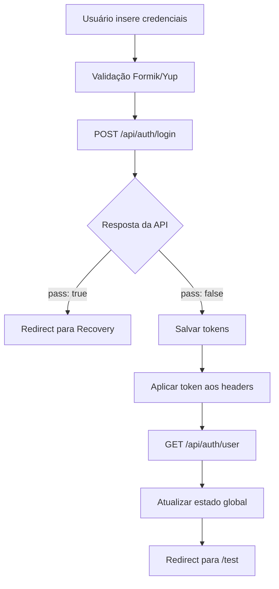
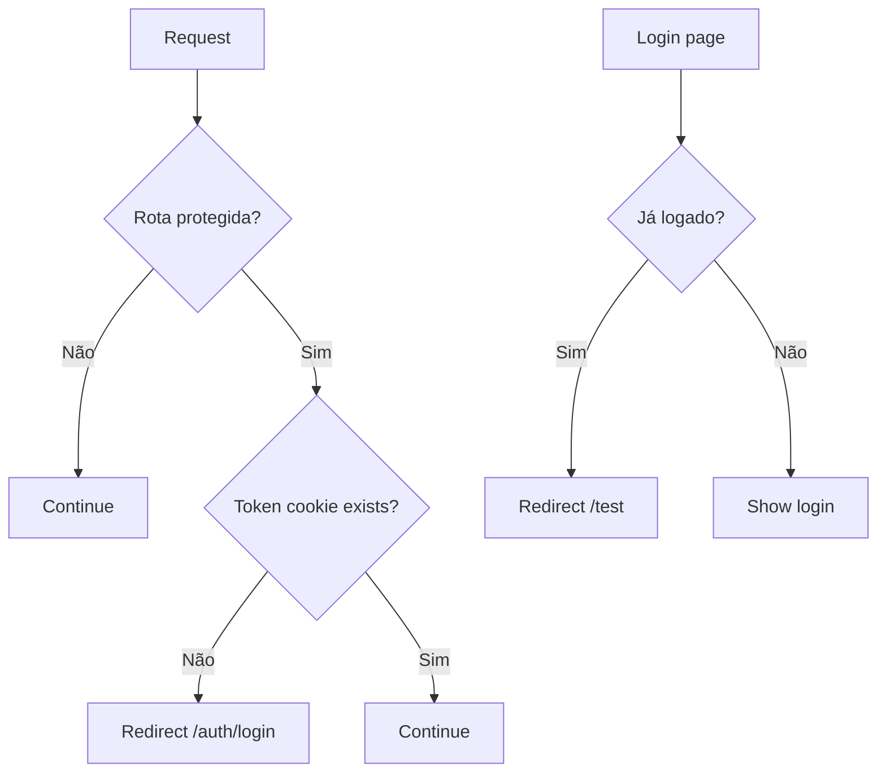

# 🔐 Documentação - Sistema de Autenticação

## Visão Geral

Este documento detalha o sistema completo de autenticação implementado no projeto **telescope-adm-nextjs**, que foi migrado do projeto React original para Next.js 15 com React 19, utilizando Tailwind CSS em substituição ao Material-UI.

## 📋 Índice

1. [Arquitetura do Sistema](#arquitetura-do-sistema)
2. [Componentes Principais](#componentes-principais)
3. [Fluxo de Autenticação](#fluxo-de-autenticação)
4. [Estrutura de Arquivos](#estrutura-de-arquivos)
5. [APIs e Endpoints](#apis-e-endpoints)
6. [Middleware de Proteção](#middleware-de-proteção)
7. [Gerenciamento de Estado](#gerenciamento-de-estado)
8. [Configurações](#configurações)
9. [Como Usar](#como-usar)
10. [Troubleshooting](#troubleshooting)

---

## 🏗️ Arquitetura do Sistema

### Stack Tecnológica
- **Framework**: Next.js 15 (App Router)
- **React**: 19.x
- **UI**: Tailwind CSS (glassmorphism design)
- **State Management**: Context API + useReducer
- **HTTP Client**: Axios
- **Validation**: Formik + Yup
- **Token Management**: JWT + Refresh Token
- **Storage**: LocalStorage + Cookies

### Padrões Arquiteturais
- **Server-Side API Routes**: Para evitar problemas de CORS
- **Proxy Configuration**: Redirecionamento transparente de APIs
- **Interceptors Pattern**: Aplicação automática de tokens
- **Context Pattern**: Gerenciamento global de estado
- **Protected Routes**: Middleware de proteção

---

## 🧩 Componentes Principais

### 1. AuthContext (`src/contexts/AuthContext.tsx`)
**Responsabilidade**: Gerenciamento global do estado de autenticação

```typescript
interface AuthContextType {
  user: IUser | null
  isAuthenticated: boolean
  isLoading: boolean
  error: string | null
  login: (username: string, password: string) => Promise<void>
  logout: () => void
  updatePassword: (username: string, newPassword: string) => Promise<void>
  notification: INotification
  setNotification: (notification: INotification) => void
  clearNotification: () => void
}
```

**Funcionalidades**:
- ✅ Login com validação
- ✅ Logout com limpeza completa
- ✅ Recuperação automática de sessão
- ✅ Alteração de senha
- ✅ Notificações integradas
- ✅ Aplicação automática de tokens

### 2. Páginas de Autenticação

#### Login (`src/app/auth/login/page.tsx`)
- **Design**: Interface glassmorphism responsiva
- **Validação**: Formik + Yup com mensagens em português
- **Features**: Remember me, loading states, error handling
- **Redirecionamento**: Automático para `/test` após login

#### Recovery (`src/app/auth/recovery/page.tsx`)
- **Funcionalidade**: Alteração de senha obrigatória
- **Suspense**: Implementado para `useSearchParams()`
- **UX**: Breadcrumbs e navegação intuitiva

#### Test Page (`src/app/test/page.tsx`)
- **Propósito**: Validação completa do sistema de auth
- **Debug**: Informações detalhadas de localStorage, cookies e estado
- **Features**: Logout, navegação, status de conectividade

### 3. Componentes Auxiliares

#### Notification (`src/components/auth/Notification.tsx`)
```typescript
interface NotificationProps {
  notification: {
    isOpen: boolean
    message: string
    type: 'success' | 'error' | 'warning' | 'info'
  }
  onClose: () => void
}
```

---

## 🔄 Fluxo de Autenticação

### 1. Processo de Login


### 2. Inicialização da Aplicação
```mermaid
graph TD
    A[App Start] --> B[AuthContext useEffect]
    B --> C{Token existe?}
    C -->|Não| D[setLoading(false)]
    C -->|Sim| E{Token válido?}
    E -->|Não| F[clearTokens + logout]
    E -->|Sim| G[Aplicar token aos headers]
    G --> H[GET /api/auth/user]
    H --> I[setUser + setAuthenticated]
```

### 3. Middleware de Proteção


---

## 📁 Estrutura de Arquivos

```
src/
├── app/
│   ├── auth/
│   │   ├── login/
│   │   │   └── page.tsx          # Página de login
│   │   └── recovery/
│   │       └── page.tsx          # Alteração de senha
│   ├── test/
│   │   └── page.tsx              # Página de teste
│   └── api/
│       └── auth/
│           ├── login/
│           │   └── route.ts      # API login
│           ├── user/
│           │   └── route.ts      # API obter usuário
│           ├── logout/
│           │   └── route.ts      # API logout
│           └── update-password/
│               └── route.ts      # API alterar senha
├── contexts/
│   └── AuthContext.tsx           # Context global
├── services/
│   ├── auth.ts                   # Cliente da API auth
│   └── token.ts                  # Gerenciamento de tokens
├── lib/
│   ├── api.ts                    # Instâncias Axios
│   ├── axios-config.ts           # Configuração global
│   └── auth-types.ts             # Interfaces TypeScript
├── components/
│   └── auth/
│       └── Notification.tsx      # Componente de notificação
└── middleware.ts                 # Proteção de rotas
```

---

## 🌐 APIs e Endpoints

### Server-Side API Routes (Next.js)

#### 1. POST `/api/auth/login`
**Função**: Autenticação de usuário
```typescript
// Request
{
  username: string
  password: string
}

// Response Success
{
  pass: boolean
  jwtToken: string
  refreshToken: string
  // ... outros dados do usuário
}
```

#### 2. GET `/api/auth/user`
**Função**: Obter dados do usuário logado
```typescript
// Headers Required
Authorization: Bearer {token}

// Response
{
  result: IUser
}
```

#### 3. POST `/api/auth/logout`
**Função**: Logout do usuário
```typescript
// Headers Required
Authorization: Bearer {token}

// Response
{ success: boolean }
```

#### 4. POST `/api/auth/update-password`
**Função**: Alterar senha do usuário
```typescript
// Request
{
  username: string
  newPassword: string
}
```

### Proxy Configuration (next.config.js)
```javascript
async rewrites() {
  return [
    {
      source: '/usershield/:path*',
      destination: 'https://servicesapp.pronutrir.com.br/usershield/:path*',
    },
    {
      source: '/apitasy/:path*',
      destination: 'https://servicesapp.pronutrir.com.br/apitasy/:path*',
    },
    {
      source: '/notify/:path*',
      destination: 'https://servicesapp.pronutrir.com.br/notify/:path*',
    },
  ]
}
```

---

## 🛡️ Middleware de Proteção

### Configuração (`src/middleware.ts`)
```typescript
export function middleware(request: NextRequest) {
  const token = request.cookies.get('token')?.value
  const { pathname } = request.nextUrl

  // Rotas públicas
  const publicRoutes = ['/auth/login', '/auth/recovery']
  
  // Rotas protegidas
  const protectedRoutes = ['/admin', '/test']

  // Lógica de proteção e redirecionamento
}

export const config = {
  matcher: [
    '/((?!api|_next/static|_next/image|favicon.ico).*)',
  ],
}
```

### Regras de Redirecionamento
1. **Rota protegida sem token** → `/auth/login`
2. **Login com token válido** → `/test`
3. **Raiz (/) sem token** → `/auth/login`
4. **Raiz (/) com token** → `/test`

---

## 🔧 Gerenciamento de Estado

### AuthReducer Pattern
```typescript
type AuthAction =
  | { type: 'SET_LOADING'; payload: boolean }
  | { type: 'SET_USER'; payload: IUser }
  | { type: 'SET_ERROR'; payload: string }
  | { type: 'CLEAR_ERROR' }
  | { type: 'LOGOUT' }

const authReducer = (state: IAuthState, action: AuthAction): IAuthState => {
  // Implementação do reducer
}
```

### Token Storage Strategy
```typescript
// Duplo armazenamento para compatibilidade
saveTokens(token: string, refreshToken: string) {
  // LocalStorage (para interceptors)
  localStorage.setItem('token', token)
  localStorage.setItem('refreshToken', refreshToken)
  
  // Cookies (para middleware)
  document.cookie = `token=${token}; path=/; secure; samesite=strict`
  document.cookie = `refreshToken=${refreshToken}; path=/; secure; samesite=strict`
}
```

### Axios Interceptors
```typescript
// Aplicação automática de token
Api.interceptors.request.use((config) => {
  const token = localStorage.getItem('token')
  if (token) {
    config.headers.Authorization = `Bearer ${token}`
  }
  return config
})

// Tratamento de erro 401
Api.interceptors.response.use(
  (response) => response,
  (error) => {
    if (error.response?.status === 401) {
      // Auto logout e redirect
    }
  }
)
```

---

## ⚙️ Configurações

### Environment Variables
```bash
# .env.local
NODE_TLS_REJECT_UNAUTHORIZED=0
```

### TypeScript Interfaces
```typescript
// src/lib/auth-types.ts
interface IUser {
  id: number
  username: string
  email: string
  nomeCompleto: string
  tipoUsuario: string
  jwtToken: string
  refreshToken: string
  // ... outras propriedades
}

interface IAuthState {
  user: IUser | null
  isAuthenticated: boolean
  isLoading: boolean
  error: string | null
}
```

---

## 🚀 Como Usar

### 1. Hook de Autenticação
```typescript
import { useAuth } from '@/contexts/AuthContext'

function MyComponent() {
  const { 
    user, 
    isAuthenticated, 
    isLoading, 
    login, 
    logout 
  } = useAuth()

  // Uso do hook
}
```

### 2. Proteção de Componentes
```typescript
function ProtectedComponent() {
  const { isAuthenticated, isLoading } = useAuth()

  if (isLoading) return <Loading />
  if (!isAuthenticated) return <Redirect to="/auth/login" />

  return <SecureContent />
}
```

### 3. Chamadas de API Autenticadas
```typescript
import { Api } from '@/lib/api'

// Token é aplicado automaticamente via interceptor
const response = await Api.get('/minha-rota-protegida')
```

---

## 🐛 Troubleshooting

### Problemas Comuns

#### 1. Token não está sendo aplicado
**Sintoma**: APIs retornam 401
**Solução**: 
- Verificar se `axiosConfig.setAuthToken()` está sendo chamado
- Confirmar se token está no localStorage
- Verificar interceptors do Axios

#### 2. Middleware não funciona
**Sintoma**: Acesso a rotas protegidas sem autenticação
**Solução**:
- Verificar se cookies estão sendo salvos
- Confirmar configuração do `middleware.ts`
- Validar `config.matcher`

#### 3. Redirecionamento infinito
**Sintoma**: Loop entre login e página protegida
**Solução**:
- Verificar consistência entre localStorage e cookies
- Confirmar validade do token
- Verificar lógica do AuthContext

#### 4. CORS errors
**Sintoma**: Erro de CORS nas chamadas de API
**Solução**:
- Confirmar configuração do proxy no `next.config.js`
- Verificar se está usando API routes do Next.js
- Validar URLs das APIs

### Debug da Autenticação

#### Página de Teste (`/test`)
A página de teste fornece informações completas para debug:
- ✅ Status de autenticação
- ✅ Dados do usuário
- ✅ Tokens (localStorage e cookies)
- ✅ Estado da aplicação
- ✅ Conectividade das APIs

#### Console Logs
```typescript
// Logs de debug implementados
console.log('🔐 Auth: Login successful', data)
console.log('🔄 Auth: Token applied to headers')
console.log('🐛 DEBUG - TestPage:', debugInfo)
```

---

## 📝 Notas de Migração

### Diferenças do Projeto Original
1. **Material-UI → Tailwind CSS**: Design system moderno
2. **CRA → Next.js**: SSR e App Router
3. **Client-side → Server-side APIs**: Melhor segurança
4. **Storage**: Duplo armazenamento (localStorage + cookies)
5. **Middleware**: Proteção nativa do Next.js

### Melhorias Implementadas
- ✅ Design glassmorphism responsivo
- ✅ TypeScript completo
- ✅ Error handling robusto
- ✅ Debug tools integradas
- ✅ Interceptors automáticos
- ✅ Proxy configuration
- ✅ Suspense boundaries
- ✅ Loading states

---

## 📚 Referências

- [Next.js Authentication](https://nextjs.org/docs/authentication)
- [App Router](https://nextjs.org/docs/app)
- [Middleware](https://nextjs.org/docs/app/building-your-application/routing/middleware)
- [API Routes](https://nextjs.org/docs/app/building-your-application/routing/route-handlers)
- [Tailwind CSS](https://tailwindcss.com/docs)

---

**Última atualização**: 06 de agosto de 2025  
**Versão**: 1.0.0  
**Autor**: Sistema de Migração telescope-ADM
