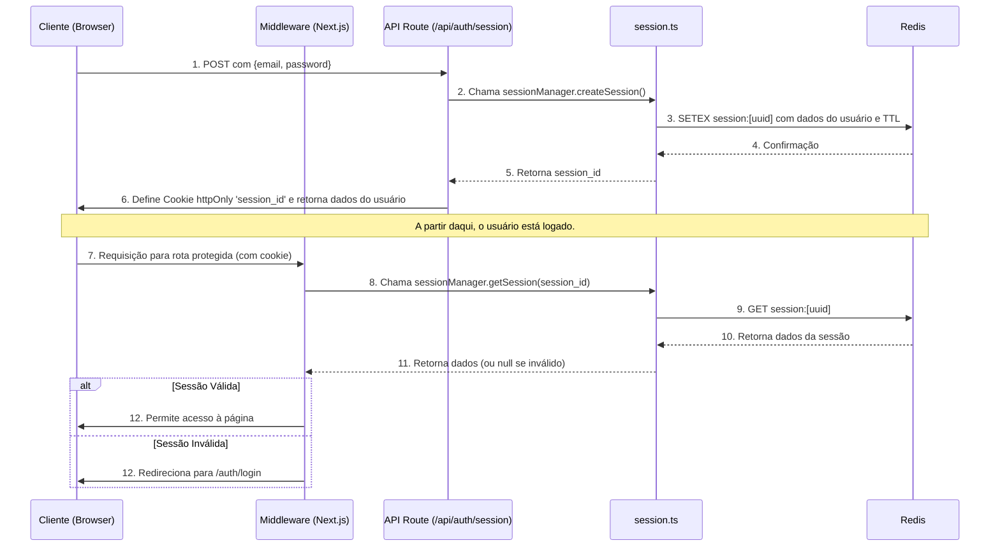

# 🛡️ Documentação Técnica da Arquitetura de Autenticação

Este documento detalha a arquitetura e o fluxo do sistema de autenticação server-side, baseado na análise direta do código-fonte. O objetivo é servir como um guia de referência para desenvolvedores que precisam manter ou expandir esta funcionalidade.

**Arquivos-chave analisados:**
1.  `src/lib/session.ts` (Gerenciador de Sessão)
2.  `src/app/api/auth/session/route.ts` (Endpoint de Login/Logout)
3.  `src/middleware.ts` (Proteção de Rotas)

---

## 1. Visão Geral da Arquitetura

O sistema é projetado para ser **stateful e centralizado**, com o **Redis** atuando como o único ponto de verdade para as sessões de usuário.

-   **Segurança:** Nenhum dado sensível (como permissões ou tokens) é armazenado no cliente. O browser armazena apenas um ID de sessão não identificável.
-   **Gerenciamento:** O ciclo de vida da sessão (criação, validação, renovação, destruição) é totalmente controlado pelo servidor.
-   **Proteção:** Um middleware intercepta as requisições para validar a sessão antes de permitir o acesso a rotas protegidas.

### Fluxo de Dados Principal


---

## 2. Análise dos Componentes

### 2.1. `src/lib/session.ts` - O Gerenciador de Sessão (`ServerSessionManager`)

Esta classe é o núcleo do sistema. Ela abstrai toda a lógica de interação com o Redis.

**Responsabilidades:**
-   Conectar-se ao Redis usando as variáveis de ambiente (`REDIS_HOST`, `REDIS_PORT`, etc.).
-   Gerenciar o ciclo de vida completo de uma sessão.

**Métodos Principais e Funcionamento:**

-   `async createSession(userData)`:
    1.  Gera um `sessionId` único usando `crypto.randomUUID()`.
    2.  Monta um objeto `sessionData` contendo os dados do usuário, além de metadados de segurança como `ipAddress` e `userAgent`.
    3.  **Limita o número de sessões ativas** por usuário através do método `limitUserSessions`.
    4.  Salva o objeto `sessionData` no Redis usando `SETEX`, que define um valor com tempo de expiração (`sessionDuration`, atualmente 4 horas). A chave é formatada como `session:{sessionId}`.
    5.  Adiciona o `sessionId` a um *set* no Redis (`user_sessions:{userId}`) para rastrear todas as sessões de um usuário específico.
    6.  Define o cookie `session_id` na resposta, configurado como `httpOnly`, `secure` e `sameSite: 'strict'`.
    7.  Retorna o `sessionId`.

-   `async getSession(sessionId)`:
    1.  Busca os dados da sessão no Redis usando a chave `session:{sessionId}`.
    2.  Se a sessão não for encontrada ou tiver expirado, retorna `null` e a remove.
    3.  **Atualiza a `lastActivity`** da sessão para controle de inatividade.
    4.  Retorna os dados da sessão.

-   `async refreshSession(sessionId)`:
    1.  Busca a sessão atual.
    2.  Recalcula a data de expiração (`expiresAt`).
    3.  Salva novamente a sessão no Redis com o novo tempo de expiração usando `SETEX`.
    4.  Atualiza o `maxAge` do cookie no browser do cliente.

-   `async destroySession(sessionId)`:
    1.  Remove a chave `session:{sessionId}` do Redis.
    2.  Remove o `sessionId` do *set* de sessões do usuário (`user_sessions:{userId}`).
    3.  Instrui o browser a deletar o cookie `session_id`.

---

### 2.2. `src/app/api/auth/session/route.ts` - O Endpoint de Autenticação

Este arquivo define a API REST para login e logout.

**`POST /api/auth/session` (Login):**
1.  Recebe o `email` e `password` do corpo da requisição.
2.  Valida os dados de entrada.
3.  **Autentica as credenciais** contra a API externa `UserShield`.
    -   Em modo de desenvolvimento, ele possui um *mock* que aceita usuários de teste como `admin` ou `test@telescope.com`.
4.  Se a autenticação for bem-sucedida:
    -   Extrai os dados do usuário (ID, nome, permissões).
    -   Coleta o `ipAddress` e `userAgent` da requisição para fins de segurança.
    -   Chama `sessionManager.createSession()` para iniciar a sessão no servidor.
    -   Retorna uma resposta de sucesso com os dados básicos do usuário (sem tokens ou informações sensíveis).
5.  Se a autenticação falhar, retorna um erro `401 Unauthorized`.

**`DELETE /api/auth/session` (Logout):**
1.  Extrai o `sessionId` do cookie da requisição.
2.  Chama `sessionManager.destroySession(sessionId)` para invalidar a sessão no Redis.
3.  Retorna uma resposta de sucesso, instruindo o browser a limpar todos os cookies relacionados à autenticação (`session_id`, `token`, `refreshToken`).

---

### 2.3. `src/middleware.ts` - O Guardião das Rotas

Este middleware é a primeira linha de defesa, protegendo as rotas da aplicação.

**Funcionamento:**
1.  Ele é executado para todas as rotas, exceto as de API e arquivos estáticos (conforme definido no `config.matcher`).
2.  **Identifica Rotas Públicas:** Mantém uma lista de rotas (`publicRoutes`) que não exigem autenticação, como `/auth/login`.
3.  **Validação de Acesso:**
    -   Se o usuário tenta acessar uma rota protegida (ex: `/admin/*`) **sem** um `session_id`, ele é imediatamente redirecionado para a página de login (`/auth/server-login`).
    -   Se o usuário **tem** um `session_id` e tenta acessar uma rota pública (como a de login), ele é redirecionado para o dashboard (`/admin/gerenciador-pdfs`), prevenindo que usuários logados vejam a página de login novamente.
4.  **Redirecionamento da Raiz:** A rota `/` é tratada de forma especial, redirecionando para o login (se não autenticado) ou para o dashboard (se autenticado).

> **⚠️ Ponto de Atenção para Desenvolvedores:**
> O arquivo `middleware.ts` atual contém a lógica básica de verificação da *existência* do cookie `session_id`. No entanto, a validação completa da sessão contra o Redis (comentada com `TODO`) ainda precisa ser implementada nele. A lógica seria:
> ```typescript
> // Dentro do middleware, para rotas protegidas:
> const session = await sessionManager.getSession(sessionId);
> if (!session) {
>   // Se a sessão não for válida no Redis, mesmo que o cookie exista
>   const response = NextResponse.redirect(new URL('/auth/login', request.url));
>   response.cookies.delete('session_id'); // Limpa o cookie inválido
>   return response;
> }
> ```

---

## 3. Conclusão e Próximos Passos

A arquitetura de autenticação é robusta, segura e centralizada. O `session.ts` fornece todas as ferramentas necessárias para um gerenciamento de sessão completo e seguro.

**Para futuros desenvolvedores:**
-   **Manutenção:** A lógica de negócios da autenticação está concentrada em `session.ts` e `session/route.ts`.
-   **Expansão:** Para adicionar novas funcionalidades de sessão (ex: "lembrar de mim"), modifique o `session.ts` para ajustar o tempo de expiração.
-   **Segurança:** A principal melhoria a ser feita é ativar a validação da sessão contra o Redis diretamente no `middleware.ts`, conforme destacado no ponto de atenção.
