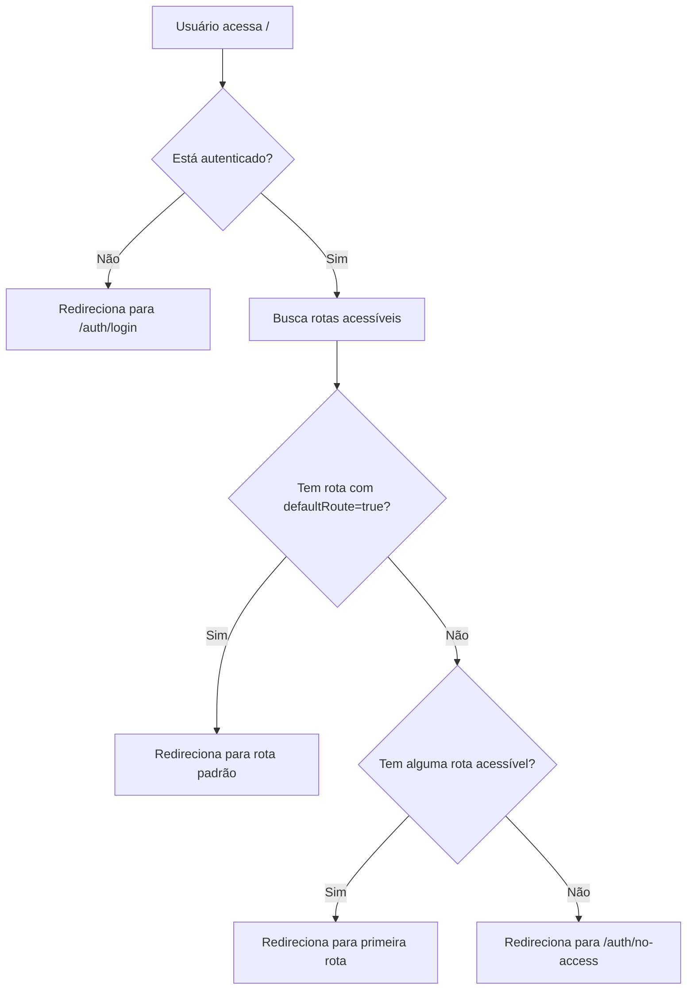

# 🔀 Sistema de Roteamento Dinâmico Baseado em Permissões

## 📋 Visão Geral

O sistema foi atualizado para redirecionar automaticamente os usuários para a primeira rota disponível baseada em suas permissões (roles), ao invés de sempre redirecionar para `/admin/dashboard`.

## 🎯 Funcionalidades

### 1. Redirecionamento Inteligente
- **Página Inicial (`/`)**: Redireciona automaticamente para a primeira rota acessível
- **Prioridade**: Rotas com `defaultRoute: true` têm prioridade
- **Fallback**: Se não houver rota padrão, usa a primeira rota acessível
- **Sem Acesso**: Usuários sem permissões são direcionados para `/auth/no-access`

### 2. Verificação de Permissões
Cada rota no `routes.ts` pode definir:
```typescript
{
  path: '/dashboard',
  name: 'Dashboard',
  roles: ['Administrador', 'Gerencial'], // Opcional
  visible: true, // Controla visibilidade no menu
  defaultRoute: true // Define como rota padrão
}
```

- **`roles`**: Lista de roles que podem acessar a rota (vazio = todos)
- **`visible`**: Controla se aparece no menu (padrão: true)
- **`defaultRoute`**: Define como rota inicial preferencial

## 🛠️ Arquivos Criados/Modificados

### 1. `/src/utils/routeUtils.ts` (NOVO)
Funções utilitárias para gerenciamento de rotas:

```typescript
// Obtém a primeira rota disponível para o usuário
getFirstAvailableRoute(user: IUser): string

// Verifica se usuário tem acesso a uma rota
hasRouteAccess(route: Route, userRoles: string[]): boolean

// Obtém todas as rotas acessíveis
getAccessibleRoutes(user: IUser): Route[]

// Verifica acesso por path
canAccessRoute(user: IUser, routePath: string): boolean
```

### 2. `/src/app/page.tsx` (MODIFICADO)
Página inicial agora usa `getFirstAvailableRoute()`:

```typescript
useEffect(() => {
    if (!isLoading && user) {
        const targetRoute = getFirstAvailableRoute(user)
        router.push(targetRoute)
    }
}, [user, isLoading, router])
```

### 3. `/src/app/auth/no-access/page.tsx` (NOVO)
Página exibida quando usuário não tem acesso a nenhuma rota:
- Mostra mensagem amigável
- Lista as permissões atuais do usuário
- Opções: Voltar ao início ou fazer logout

## 📊 Fluxo de Redirecionamento



## 🔐 Estrutura de Permissões

### Extração de Roles
```typescript
const userRoles = user.roles?.map(role => role.perfis.nomePerfil) || []
// Exemplo: ['Administrador', 'Gerencial']
```

### Verificação de Acesso
```typescript
// Rota sem roles = acesso público
if (!route.roles || route.roles.length === 0) {
    return true
}

// Verifica se tem pelo menos uma role necessária
return route.roles.some(requiredRole => 
    userRoles.some(userRole => userRole === requiredRole)
)
```

## 🎨 Configuração de Rotas

### Exemplo: Rota Padrão
```typescript
{
    path: '/gerenciador-pdfs',
    name: 'Gerenciador de PDFs',
    icon: FileText,
    iconColor: 'Warning',
    layout: '/admin',
    private: false,
    defaultRoute: true, // ✅ Rota padrão
    visible: true
}
```

### Exemplo: Rota Restrita
```typescript
{
    path: '/bloqueios',
    name: 'Bloqueios',
    icon: Shield,
    layout: '/admin',
    private: false,
    roles: ['default_fullstackdev', 'Gerencial', 'Administrador'],
    visible: false // Oculta do menu
}
```

### Exemplo: Rota Pública
```typescript
{
    path: '/dashboard',
    name: 'Dashboard',
    icon: BarChart3,
    layout: '/admin',
    private: false,
    // Sem roles = acessível por todos
    visible: true
}
```

## 🚀 Uso Prático

### No Componente de Menu
```typescript
import { getAccessibleRoutes } from '@/utils/routeUtils'

const menuItems = getAccessibleRoutes(user)
// Retorna apenas rotas que o usuário pode acessar
```

### Proteção de Rotas
```typescript
import { canAccessRoute } from '@/utils/routeUtils'

if (!canAccessRoute(user, '/admin/bloqueios')) {
    router.push('/auth/no-access')
}
```

### Verificação Manual
```typescript
import { hasRouteAccess } from '@/utils/routeUtils'

const userRoles = ['Administrador', 'Gerencial']
const route = routes.find(r => r.path === '/dashboard')

if (hasRouteAccess(route, userRoles)) {
    // Usuário pode acessar
}
```

## 📝 Logs e Debug

O sistema inclui logs para facilitar debugging:

```
✅ Rota padrão encontrada: /admin/gerenciador-pdfs
✅ Primeira rota disponível: /admin/dashboard
⚠️ Nenhuma rota acessível encontrada para o usuário: john.doe
🔀 Redirecionando usuário para: /admin/gerenciador-pdfs
```

## 🔄 Migração de Código Antigo

### Antes
```typescript
// Sempre redirecionava para dashboard
router.push('/admin/dashboard')
```

### Depois
```typescript
// Redireciona dinamicamente baseado em permissões
const targetRoute = getFirstAvailableRoute(user)
router.push(targetRoute)
```

## ⚠️ Considerações Importantes

1. **Middleware**: O middleware apenas verifica se há `session_id`, não valida permissões
2. **Client-Side**: A verificação de permissões acontece no cliente via `routeUtils`
3. **Server-Side**: Para proteção real, implemente verificação no servidor (route handlers)
4. **Fallback**: Sempre configure pelo menos uma rota com `defaultRoute: true`
5. **Roles**: Use nomes de perfis consistentes entre backend e frontend

## 🎯 Próximos Passos

- [ ] Implementar verificação de permissões server-side nos route handlers
- [ ] Adicionar cache de rotas acessíveis no contexto
- [ ] Criar componente de proteção de rota (`<ProtectedRoute>`)
- [ ] Implementar página 404 com sugestões de rotas acessíveis
- [ ] Adicionar analytics para rastrear acessos negados

## 📚 Referências

- `src/utils/routeUtils.ts` - Funções utilitárias
- `src/config/routes.ts` - Configuração de rotas
- `src/lib/auth-types.ts` - Tipos de usuário e roles
- `src/app/page.tsx` - Página inicial
- `src/app/auth/no-access/page.tsx` - Página sem acesso
